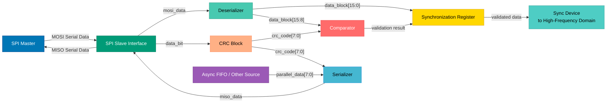

# Preliminary Design Report - Low Frequency Components

**Note**: This is a draft document based on the content from 'CONTEXT.md'. It may require further refinement to fully meet the PDR standards as outlined in 'PDR_template.md'.

This report details the design and architecture of the low-frequency components of the ADC standalone IP for the CI-INOVADOR specialization course program. These components include the SPI Slave Interface, Deserializer, Serializer, and CRC Block, which facilitate communication between an external SPI Master and the internal system up to the interfaces for high-frequency portions.

## 1. Overview

The low-frequency components of the circuit are responsible for handling SPI communication with an external master, performing serial-to-parallel and parallel-to-serial data conversion, and ensuring data integrity through CRC validation and generation. These components operate at up to 1 MHz and include the following blocks:

- **SPI Slave Interface**: Manages communication with the external SPI Master, supporting read/write transactions with configuration inputs (cpol, cpha, bit_order), clocks (clk, sck), reset, transaction signals (ss, mosi, miso), and status output (spi_busy).
- **Deserializer**: Converts serial data received via SPI (mosi) into parallel data for internal processing, supporting MSB/LSB order and burst data handling.
- **Serializer**: Converts parallel data from internal processing to serial data for SPI transmission (miso), also supporting MSB/LSB order and burst data.
- **CRC Block**: Implements the CRC&CCITT algorithm for error correction, handling validation of incoming data during write operations and generation of CRC for outgoing data during read operations, with feedback on data mismatch.

These blocks play a critical role in ensuring reliable data transfer between the external SPI Master and the internal system, adhering to the project constraints such as a single CRC block and specific data format (4-bit operation field with 1 bit for operation type extended by 3 zeros, 12-bit address, 16-bit data, 8-bit CRC). The primary performance target is operation at up to 1 MHz as defined in the proposal.

## 2. Microarchitecture

This section details the internal structure and behavior of the low-frequency components, providing a hierarchical breakdown and data/control flow.

### Module Hierarchy
The low-frequency components are organized as follows:
- **SPI Slave Interface**: Central controller interfacing with the external SPI Master and internal blocks.
- **Deserializer**: Sub-module for serial-to-parallel conversion of incoming data.
- **Serializer**: Sub-module for parallel-to-serial conversion of outgoing data.
- **CRC Block**: Sub-module for error detection and correction, integrated with both incoming and outgoing data paths.
- **APB Bus Interface**: Connects low-frequency logic to the rest of the system (note: detailed integration with high-frequency components to be covered in a broader system report).

### Sub-Module Functionality
- **SPI Slave Interface**: Handles SPI protocol logic for configuration (cpol, cpha, bit_order) and transaction timing, forwarding data to Deserializer/CRC for write operations and from Serializer for read operations. Outputs status signal spi_busy to indicate ongoing transactions.
- **Deserializer**: Processes serial input (mosi_data) bit-by-bit into a 16-bit shift register, outputting data_block[15:0] to a synchronization register and comparator for further processing, supporting burst handling.
- **Serializer**: Serializes parallel data (parallel_data[7:0] and crc_code[7:0]) into serial output (miso_data) for MISO transmission, supporting burst handling.
- **CRC Block**: Generates 8-bit CRC codes (crc_code[7:0]) using the CRC&CCITT algorithm from bit-by-bit input (data_bit), used for validation in write operations and appending in read operations.

### Data and Control Flow
- **Write Operation Flow**: Serial data enters via SPI Slave Interface (MOSI), driven by sck (up to 1 MHz). It is sent to both Deserializer for conversion to parallel format (data_block[15:0]) and CRC Block for CRC generation (crc_code[7:0]). The Deserializer outputs to a synchronization register and comparator (with data_block[15:8] for CRC comparison), and the CRC Block outputs to the comparator. If valid, data transitions to a sync device for high-frequency processing.
- **Read Operation Flow**: Parallel data (parallel_data[7:0]) from an async FIFO or other source is sent to the Serializer, while CRC Block generates crc_code[7:0] from bit-by-bit data. The Serializer converts and transmits combined data via SPI Slave Interface (MISO).
- **Control Signals**: SPI Slave Interface manages ss, cpol, cpha, bit_order, and spi_busy. Control signals coordinate Deserializer/Serializer data processing and CRC generation/validation, with burst handling based on ss state.

### Diagrams and Waveforms
Refer to the schematic 'spi-top.png' for a visual representation of the architecture and interconnections. Below is a data flow diagram using Mermaid to illustrate interactions and data paths:



Additionally, a Finite State Machine (FSM) diagram for control logic is provided in Section 4.

### Instantiation and Integration
To instantiate these low-frequency components into a higher-level design, connect the SPI Slave Interface to the external SPI Master pins (MOSI, MISO, SCK, SS) and provide configuration inputs (cpol, cpha, bit_order) and system clock (clk) and reset signals. The output from the synchronization register should connect to a sync device for high-frequency domain interfacing, and the async FIFO or other data source should feed into the Serializer for read operations. Detailed connectivity and clock enables will be specified in the complete system integration documentation.

## 3. Clock and Reset Strategy

### Clocking Scheme
- **Clock Domains**: The low-frequency components operate across two clock domains:
  - System clock (clk): Governs internal operations of SPI Slave Interface status signals, Deserializer, Serializer, and CRC Block.
  - Serial clock (sck): Operates at up to 1 MHz, driving transaction timing for SPI data input (MOSI) and output (MISO), sourced from the external SPI Master.
- **Sources**: The system clock (clk) is provided by the internal system, while sck is an external input from the SPI Master.

### Clock Domain Crossings (CDCs)
- Signals crossing between sck and clk domains, such as data transitions at the SPI Slave Interface or spi_busy status, will use synchronization mechanisms like 2-flop synchronizers or handshake protocols to ensure reliable data transfer. Specific CDC implementations will be detailed during RTL design.

### Reset Strategy
- **Reset Signal**: A system reset signal (reset), active low, is used across all blocks.
- **Type**: Implements an asynchronous assert phase and synchronous deassert phase to prevent glitches during reset transitions, ensuring reliable initialization of all control and data paths.

### Architectural Clock Gating
- No architectural clock gating is currently planned for power savings in the low-frequency components due to the continuous operation requirement during SPI transactions. If power optimization becomes a priority, enable conditions for clock gates can be explored in future design iterations.

## 4. Module Operation

This section provides a guide to configuring and operating the low-frequency components, focusing on initialization, operating modes, and control logic.

### Initialization Sequence
- After a system reset (active low), the SPI Slave Interface enters an Idle state, setting spi_busy to inactive (high).
- Configuration inputs (cpol, cpha, bit_order) must be set before any transaction begins to define clock polarity, phase, and data order.
- The system awaits slave select (ss) activation (active low) from the external SPI Master to initiate a transaction.

### Operating Modes and Use-Cases
- **Write Mode (Data Reception)**:
  - **Trigger**: Operation bit received as 0 via MOSI.
  - **Steps**: 
    1. SPI Slave Interface sets spi_busy to active (low) and forwards serial data to Deserializer and CRC Block.
    2. Deserializer converts data to parallel format (data_block[15:0]), outputting to synchronization register and comparator (data_block[15:8] for CRC).
    3. CRC Block generates crc_code[7:0] for comparison at the comparator.
    4. If valid, data is forwarded to sync device; if invalid, error feedback is generated.
    5. Supports burst transactions by looping reception while ss remains active.
- **Read Mode (Data Transmission)**:
  - **Trigger**: Operation bit received as 1 via MOSI.
  - **Steps**:
    1. SPI Slave Interface sets spi_busy to active (low) and signals to fetch parallel data.
    2. Parallel data (parallel_data[7:0]) from async FIFO or other source is sent to Serializer, while CRC Block generates crc_code[7:0].
    3. Serializer converts data and CRC to serial format (miso_data) for transmission via MISO.
    4. Supports burst transactions by fetching additional data while ss remains active.
- **Use-Case Notes**: Both modes adhere to the data format (4-bit operation field, 12-bit address, 16-bit data, 8-bit CRC) and operate under sck timing up to 1 MHz.

### Interrupts and Status Flags
- **spi_busy**: Active low signal indicating an ongoing SPI transaction, set during operation detection, reception, validation, and transmission states. Used by internal system components to monitor transaction status.
- **Error Feedback**: Generated by the comparator during write mode if CRC validation fails (data_block[15:8] does not match crc_code[7:0]), signaling an integrity issue with received data. Specific interrupt mechanisms will be defined in system-level integration.

### Finite State Machine (FSM) Design
The control logic is managed by an FSM within the SPI Slave Interface, detailed as follows:

- **State Definitions for Write Flow**:
  - **Idle State**: Wait for transaction initiation (ss active low), spi_busy inactive.
  - **Config State**: Read configuration settings (cpol, cpha, bit_order).
  - **Operation Detect State**: Determine operation type (0 for write), set spi_busy active.
  - **Receive State**: Forward MOSI data to Deserializer and CRC Block, track bit count for data segments.
  - **Validate State**: Compare CRC for integrity, forward valid data or generate error feedback.
- **State Definitions for Read Flow**:
  - **Idle, Config, Operation Detect States**: Shared with write flow, transition to Transmit on operation bit 1 (read).
  - **Transmit State**: Fetch parallel data, serialize with CRC, transmit via MISO, support burst if ss active.
- **FSM Diagram**:
  ```mermaid
  stateDiagram-v2
      [*] --> Idle
      Idle --> Config: ss active (low)
      Config --> OperationDetect: Config complete
      OperationDetect --> Receive: Operation bit = 0 (Write)
      OperationDetect --> Transmit: Operation bit = 1 (Read)
      Receive --> Validate: Full data block received
      Validate --> Idle: Validation complete, ss inactive
      Validate --> Receive: Validation complete, ss active (burst)
      Transmit --> Idle: Full data block transmitted, ss inactive
      Transmit --> Transmit: ss active (burst)
      
      note right of Idle
          Wait for transaction initiation
      end note
      note right of Config
          Read cpol, cpha, bit_order
      end note
      note right of OperationDetect
          Determine Write/Read operation
      end note
      note right of Receive
          Forward MOSI data to Deserializer & CRC
      end note
      note right of Validate
          Compare CRC for data integrity
      end note
      note right of Transmit
          Serialize and transmit MISO data
      end note
  ```

## 5. Register Map

**Placeholder**: A detailed definition of programmable registers within the low-frequency components is not currently specified in the documentation. Potential registers may include configuration settings for cpol, cpha, and bit_order, as well as status flags like spi_busy or error indicators. A comprehensive register map will be developed during RTL design and integration phases, to be included in the final PDR. This section will be updated to follow a tabular format as per the PDR template once details are available.

## 6. Work Planning

The following table outlines the plan for completing the design and verification of the low-frequency components:

| Task                                      | Assigned To      | Estimated Effort (Days) | Dependencies                                      | Estimated Deadline                       |
|-------------------------------------------|------------------|-------------------------|--------------------------------------------------|------------------------------------------|
| SPI Slave Interface Design - Configuration Logic | [Your Name] | 1                       | None                                             | [Suggest a date, e.g., 1 day from start] |
| SPI Slave Interface Design - Transaction Handling | [Your Name] | 2                       | None                                             | [Suggest a date, e.g., 3 days from start] |
| SPI Slave Interface Design - Status Signals | [Your Name] | 1                       | None                                             | [Suggest a date, e.g., 4 days from start] |
| SPI Slave Interface Design - Documentation | [Your Name] | 1                       | None                                             | [Suggest a date, e.g., 5 days from start] |
| CRC Implementation - Validation Logic     | [Your Name]      | 1.5                     | SPI Slave Interface Design                       | [Suggest a date, e.g., after SPI completion] |
| CRC Implementation - Generation Logic     | [Your Name]      | 1                       | SPI Slave Interface Design                       | [Suggest a date, e.g., after SPI completion] |
| CRC Implementation - Documentation        | [Your Name]      | 0.5                     | SPI Slave Interface Design                       | [Suggest a date, e.g., after SPI completion] |
| Serializer and Deserializer Logic - Deserializer Design | [Your Name] | 1.5                     | SPI Slave Interface Design                       | [Suggest a date, e.g., after SPI completion] |
| Serializer and Deserializer Logic - Serializer Design | [Your Name] | 1.5                     | SPI Slave Interface Design                       | [Suggest a date, e.g., after SPI completion] |
| Serializer and Deserializer Logic - Documentation | [Your Name] | 1                       | SPI Slave Interface Design                       | [Suggest a date, e.g., after SPI completion] |
| APB Bus Interface Design - Interface Logic | [Your Name]     | 2                       | SPI Slave Interface Design, CRC, Serializer/Deserializer | [Suggest a date, e.g., after dependent tasks] |
| APB Bus Interface Design - Integration    | [Your Name]      | 1                       | SPI Slave Interface Design, CRC, Serializer/Deserializer | [Suggest a date, e.g., after dependent tasks] |
| APB Bus Interface Design - Documentation  | [Your Name]      | 1                       | SPI Slave Interface Design, CRC, Serializer/Deserializer | [Suggest a date, e.g., after dependent tasks] |
| Documentation for PDR - Overview Section  | [Your Name]      | 0.5                     | Completion of all design tasks                   | [Suggest a date, e.g., after design completion] |
| Documentation for PDR - Microarchitecture | [Your Name]      | 1                       | Completion of all design tasks                   | [Suggest a date, e.g., after design completion] |
| Documentation for PDR - Clock/Reset Strategy | [Your Name]   | 0.5                     | Completion of all design tasks                   | [Suggest a date, e.g., after design completion] |
| Documentation for PDR - Module Operation  | [Your Name]      | 0.5                     | Completion of all design tasks                   | [Suggest a date, e.g., after design completion] |
| Documentation for PDR - Register Map      | [Your Name]      | 0.5                     | Completion of all design tasks                   | [Suggest a date, e.g., after design completion] |
| Verification Plan - Testbench Development | [Your Name]      | 1.5                     | Completion of design tasks                       | [Suggest a date, e.g., after design completion] |
| Verification Plan - Test Cases            | [Your Name]      | 2                       | Completion of design tasks                       | [Suggest a date, e.g., after design completion] |
| Verification Plan - Coverage Metrics      | [Your Name]      | 1                       | Completion of design tasks                       | [Suggest a date, e.g., after design completion] |
| Verification Plan - Documentation         | [Your Name]      | 0.5                     | Completion of design tasks                       | [Suggest a date, e.g., after design completion] |

This work plan ensures a structured approach to completing the design, documentation, and verification of the low-frequency components, aligning with the project's objectives and timelines.
