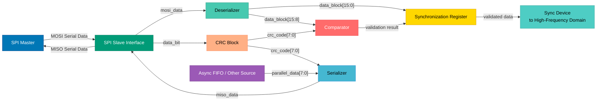
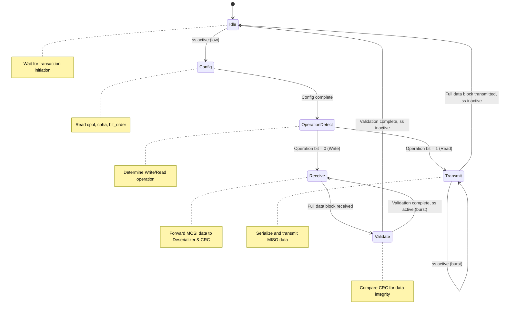

# Context

This repository hosts the development of a project for the CI-INOVADOR specialization course program. Our team is tasked with implementing the circuit proposed in [Proposal_Phase_II.pdf](Proposal_Phase_II.pdf). As part of this effort, I am responsible for the low-frequency components of the circuit, which include the SPI, CRC, serializer, and deserializer logic, up to the interfaces for the high-frequency portions. The schematic [spi-top](spi-top.png) represents the outcome of our team's discussions and serves as a visual guide for the circuit's architecture. This context will inform the planning and drafting of our Preliminary Design Report (PDR), following the structure provided in [PDR_template.md](PDR_template.md), to ensure alignment with the project's objectives and requirements.

All updates on the architecture, planning or execution of tasks shall be written first in this file before proceeding to execution.

## Objective

List all necessary blocks for the SPI and describe its interfaces.
Add details on how each component interacts with each other.

## Changes

The content of this section shall be executed and erased afterwards. The section header and this paragraph remains.

- Evaluate if the content of this file satisfies the needs stated from the [PDR_template.md](PDR_template.md).
- If the previous evaluation is satisfied, copy the contents from this file to a new file called PDR_low_frequency.md.

## Blocks

The low-frequency components of the circuit include the following blocks related to the SPI Slave interface and associated logic, as per the specifications. Each block is detailed below with its functionality, internal logic, and specific inputs and outputs, providing a comprehensive overview of their roles and interfaces in the system.

### SPI Slave Interface

- **Overview**: Handles communication with the external SPI Master, facilitating read/write transactions at up to 1 MHz.
- **Logic Details**: Implements SPI protocol logic for configuration settings and transaction timing. Supports data format with 16-bit data blocks followed by 8-bit CRC, totaling 24 bits per block.
- **Inputs**:
  - cpol (from external configuration source): Defines serial clock polarity (0 for idle low, 1 for idle high).
  - cpha (from external configuration source): Defines serial clock active phase (0 or 1 for data capture timing).
  - bit_order (from external configuration source): Determines data order (0 for LSB first, 1 for MSB first).
  - clk (from system clock source): System clock for internal operations.
  - sck (from external SPI Master): Serial clock for transaction timing, up to 1 MHz.
  - reset (from system reset source): Active low reset signal for initialization.
  - ss (from external SPI Master): Slave select signal, active low, to enable communication.
  - mosi (from external SPI Master): Master-Out Slave-In serial data input for receiving commands and data.
  - miso (from internal system): Master-In Slave-Out serial data input for internal processing or forwarding.
- **Outputs**:
  - miso (to external SPI Master): Master-In Slave-Out serial data output for transmitting data back to the master.
  - mosi (to internal system): Master-Out Slave-In serial data output for forwarding to internal blocks like Deserializer and CRC Block.
  - spi_busy (to internal system): Status signal indicating ongoing transaction, active low.

### Deserializer

- **Overview**: Converts serial data from SPI (MOSI) into parallel data for internal processing, acting solely as a shift register.
- **Logic Details**: Processes serial input bit-by-bit using a 16-bit wide shift buffer to assemble 16-bit data blocks. Does not handle CRC logic, focusing only on serial-to-parallel conversion. Supports burst data handling based on configured bit order (MSB/LSB).
- **Inputs**:
  - mosi_data (from SPI Slave Interface): Serial input data stream to be converted to parallel format.
  - bit_order (from SPI Slave Interface): Configuration signal for MSB (1) or LSB (0) first processing.
  - sck (from SPI Slave Interface): Serial clock for timing conversion.
  - ss (from SPI Slave Interface): Slave select signal for burst handling.
- **Outputs**:
  - data_block[15:0] (to synchronization register and comparator): 16-bit parallel data block for further processing and comparison with CRC.

### Serializer

- **Overview**: Converts parallel data from internal processing to serial data for SPI transmission (MISO).
- **Logic Details**: Serializes parallel data bit-by-bit based on configured bit order (MSB/LSB). Handles burst data for continuous transmission while slave select is active.
- **Inputs**:
  - parallel_data[7:0] (from async FIFO or CRC Block): Parallel data segments to be serialized, potentially including CRC codes.
  - bit_order (from SPI Slave Interface): Configuration signal for MSB (1) or LSB (0) first serialization.
  - sck (from SPI Slave Interface): Serial clock for timing conversion.
  - ss (from SPI Slave Interface): Slave select signal for burst handling.
- **Outputs**:
  - miso_data (to SPI Slave Interface): Serial output data stream for transmission via MISO.

### CRC Block

- **Overview**: Implements the CRC&CCITT algorithm for generating CRC codes for validation of incoming data and for outgoing data transmission.
- **Logic Details**: Receives 1 bit per clock cycle directly from MOSI (write operations) or MISO path (read operations) to cumulatively generate the CRC code. The generated CRC is used for external comparison with deserialized CRC segments (write) or for transmission via Serializer (read). Operates in the low-frequency domain.
- **Inputs**:
  - data_bit (from MOSI via SPI Slave Interface for write, or MISO path for read): One bit per clock cycle for CRC code generation.
  - clk (from system clock source): System clock for processing timing.
  - reset (from system reset source): Active low reset signal to initialize CRC logic.
- **Outputs**:
  - crc_code[7:0] (to comparator for write, or Serializer for read): Generated 8-bit CRC code for comparison or transmission.

**Interaction Between Components**:

- Data received via the SPI Slave Interface (MOSI) is forwarded as a serial stream to both the Deserializer for conversion into parallel format (extracting 16-bit data blocks) and the CRC Block for direct bit-by-bit CRC generation. The Deserializer outputs parallel data to a synchronization register and a comparator for further processing. The CRC Block generates an 8-bit CRC code which is sent to the comparator for validation against the deserialized CRC segment during write operations.
- For outgoing data, parallel data from an async FIFO or other internal source is sent to the Serializer for conversion to serial format. The CRC Block also provides an 8-bit CRC code to the Serializer for appending to the outgoing data during read operations. The Serializer then transmits the serial data through the SPI Slave Interface (MISO) to the external SPI Master.
- Control signals and configuration settings govern the operation mode (read/write), data order, and clocking, ensuring synchronized interaction across all blocks. Burst handling in the Deserializer and Serializer supports continuous data transactions during active slave select periods. Validated data from the synchronization register transitions to a sync device for processing in the high-frequency domain.

**Note on Schematic**: Refer to the schematic 'spi-top.png' (displayed above as 'spi-top') for a visual representation of the architecture and interconnections between the SPI Slave Interface, Deserializer, Serializer, and CRC Block. This diagram provides a detailed view of the data and control flow specific to the low-frequency components of the circuit.

## Architecture

The architecture of the low-frequency components of the circuit is designed to facilitate communication between an external SPI Master and the internal system via the APB Bus Interface, ensuring reliable data transfer with error correction. This section elaborates on the relationships between the blocks, the data flow, and the control mechanisms that govern their interactions, providing a foundation for the microarchitecture details in the Preliminary Design Report (PDR).

### Block Relationships

The low-frequency components include the SPI Slave Interface, Deserializer, Serializer, CRC Block, and APB Bus Interface. Their relationships are structured to handle serial-to-parallel and parallel-to-serial data conversion, error checking, and system integration:

- **SPI Slave Interface to Deserializer/Serializer**: The SPI Slave Interface receives serial data from the external SPI Master via the MOSI line and sends it to the Deserializer for conversion to parallel format during write operations. For read operations, it receives parallel data converted to serial format by the Serializer and transmits it via the MISO line. Control signals such as slave select (ss), clock polarity (cpol), clock phase (cpha), and bit order (bit_order) configure the data transfer mode and order.
- **Deserializer to CRC Block**: The Deserializer outputs parallel data (formatted as a 4-bit operation field, 12-bit address, 16-bit data, and 8-bit CRC) to the CRC Block for validation during write operations. If a mismatch is detected, feedback is provided to indicate an error.
- **CRC Block to APB Bus Interface**: Validated parallel data from the CRC Block is forwarded to the APB Bus Interface for further processing or storage in the system during write operations. For read operations, the CRC Block receives parallel data from the APB Bus Interface, generates an 8-bit CRC, and passes it to the Serializer.
- **Serializer to SPI Slave Interface**: The Serializer converts parallel data, including the generated CRC, back to serial format for transmission through the SPI Slave Interface's MISO line during read operations.
- **Control and Status Signals**: The SPI Slave Interface manages status signals like spi_busy to indicate ongoing transactions, while configuration inputs and clocks (system clk and sck up to 1 MHz) synchronize operations across all blocks.

### Data Flow

The data flow through the low-frequency components is bidirectional, supporting both write and read operations:

- **Write Operation Flow**: Data enters as serial input via the SPI Slave Interface (MOSI), driven by the external SPI Master's serial clock (sck). This serial stream is sent to both the Deserializer for conversion into parallel format (adhering to the configured bit order MSB/LSB) and the CRC Block for direct bit-by-bit CRC generation. The Deserializer outputs parallel data structured as a 4-bit operation field (1 bit operation type extended with 3 zeros), 12-bit address, 16-bit data, and 8-bit CRC to a synchronization register and a comparator. The CRC Block generates an 8-bit CRC code for comparison with the deserialized CRC segment at the comparator. If valid, the data (operation, address, and 16-bit data) transitions to a sync device for processing in the high-frequency domain.
- **Read Operation Flow**: Data is retrieved from the system in parallel format (12-bit address, 16-bit data) via an async FIFO or other source and sent to the Serializer for conversion to serial format based on the configured bit order. Simultaneously, the CRC Block receives bit-by-bit data from the MISO path to generate an 8-bit CRC for error correction, which is also sent to the Serializer. The combined serial data and CRC are transmitted back to the external SPI Master through the SPI Slave Interface (MISO), synchronized by the sck clock.
- **Burst Handling**: Both Deserializer and Serializer support burst data transactions, allowing continuous data transfer while the slave select (ss) signal remains active, ensuring efficient communication for multiple data packets.

### Data Flow Diagram

Below is a visual representation of the data flow between the low-frequency blocks using a Mermaid flowchart, illustrating the interactions and data paths described above.

### Diagram Reference

Refer to the schematic 'spi-top.png' (displayed above as 'spi-top') for a visual representation of the architecture. This diagram illustrates the interconnections between the SPI Slave Interface, Deserializer, Serializer, CRC Block, and APB Bus Interface, highlighting data paths and control signal flows specific to the low-frequency components. The textual description above complements the visual by detailing the operational context and constraints of each interaction.

### Clock and Reset Architecture

The low-frequency components operate across specific clock domains to ensure synchronized data handling:

- **Clock Domains**: The system clock (clk) governs internal operations of the SPI Slave Interface status signals, Deserializer, Serializer, CRC Block, and APB Bus Interface. The serial clock (sck), operating at up to 1 MHz as defined in the proposal, drives transaction timing for SPI data input (MOSI) and output (MISO).
- **Reset Strategy**: A system reset signal (reset), active low, is used across the blocks with an asynchronous assert phase and a synchronous deassert phase to ensure reliable initialization. This strategy prevents glitches during reset transitions, maintaining data integrity.
- **Clock Domain Crossings**: Signals crossing between the sck and system clk domains, such as data transitions at the SPI Slave Interface, are managed with appropriate synchronization mechanisms to be detailed in the PDR (e.g., 2-flop synchronizers or handshake protocols).

This architecture ensures efficient, reliable data transfer between the external SPI Master and the internal system, adhering to project constraints and specifications, and sets the stage for detailed microarchitecture documentation in the PDR.

## Control Logic Design

This section outlines the control logic for the low-frequency components of the circuit, focusing on managing data transactions via the SPI Slave Interface for both write and read flows. The control logic ensures proper operation by coordinating interactions between the SPI Slave Interface, Deserializer, Serializer, and CRC Block, adhering to the specified data format (4-bit operation field with 1 bit for operation type extended by 3 zeros, 12-bit address, 16-bit data, 8-bit CRC) and operating at up to 1 MHz.

### Write Flow Control Logic

The write flow involves receiving serial data from the SPI Master via MOSI, deserializing it, generating and validating CRC, and forwarding validated data to a sync device for high-frequency domain processing. The control logic for this flow is detailed below:

- **SPI Slave Interface Control**:
  - Detects slave select (ss) activation (active low) to initiate a transaction.
  - Interprets configuration signals (cpol, cpha, bit_order) to set clock polarity, phase, and data order for the transaction.
  - Generates spi_busy signal (active low) to indicate an ongoing transaction to internal blocks.
  - Forwards serial data from MOSI to both Deserializer and CRC Block bit-by-bit using sck timing.

- **Deserializer Control**:
  - Uses sck to clock in serial data (mosi_data) bit-by-bit into a 16-bit shift register, respecting bit_order configuration.
  - Tracks the number of bits received to identify completion of a 16-bit data block (plus additional bits for operation field, address, and CRC as per format).
  - Signals completion of a data block to a synchronization register and comparator for further processing, outputting data_block[15:0].
  - Supports burst handling by continuing to deserialize data while ss remains active.

- **CRC Block Control**:
  - Receives data_bit directly from MOSI via SPI Slave Interface, clocked by sck, to cumulatively generate CRC using the CRC&CCITT algorithm.
  - Tracks the bit count to align CRC generation with the data format (after 32 bits for operation, address, and data, generates 8-bit CRC for comparison).
  - Outputs crc_code[7:0] to a comparator upon completion of CRC calculation for validation against the received CRC segment.

- **Comparator Control**:
  - Receives data_block[15:8] (the 8-bit CRC segment) from Deserializer and crc_code[7:0] from CRC Block.
  - Compares the generated CRC (crc_code[7:0]) with the received CRC segment (data_block[15:8]) to validate data integrity.
  - Outputs a validation result signal to the synchronization register to indicate if the data is valid for forwarding to the sync device.

- **Timing and State Management**:
  - Utilizes a finite state machine (FSM) in the SPI Slave Interface to manage states: Idle (waiting for ss activation), Config (reading configuration), Receive (forwarding data to Deserializer and CRC Block), and Busy (maintaining spi_busy signal).
  - Coordinates timing between Deserializer and CRC Block to ensure data block and CRC code are ready simultaneously for comparison.
  - Handles burst transactions by looping back to Receive state while ss is active.

### Read Flow Control Logic

The read flow involves retrieving parallel data from an internal source (e.g., async FIFO), generating CRC, serializing the data, and transmitting it to the SPI Master via MISO. The control logic for this flow is detailed below:

- **SPI Slave Interface Control**:
  - Detects slave select (ss) activation and interprets configuration signals (cpol, cpha, bit_order) for transaction setup.
  - Generates spi_busy signal to indicate an ongoing transaction.
  - Receives serial data input from Serializer (miso_data) and transmits it to SPI Master via MISO, while forwarding bit-by-bit data to CRC Block for CRC generation if needed.

- **Serializer Control**:
  - Receives parallel_data[7:0] from an async FIFO or other source, and crc_code[7:0] from CRC Block for appending to the data.
  - Uses sck to serialize data bit-by-bit into miso_data, respecting bit_order configuration.
  - Tracks the number of bits sent to ensure complete transmission of data blocks and CRC segments.
  - Supports burst handling by continuing serialization while ss remains active, fetching additional data as needed.

- **CRC Block Control**:
  - Receives data_bit from the MISO path (or internal data stream) bit-by-bit, clocked by sck, to generate an 8-bit CRC using the CRC&CCITT algorithm.
  - Outputs crc_code[7:0] to the Serializer for appending to the outgoing data block after the 16-bit data transmission.

- **Timing and State Management**:
  - Utilizes an FSM in the SPI Slave Interface to manage states: Idle (waiting for ss activation), Config (reading configuration), Transmit (receiving data from Serializer and forwarding to MISO), and Busy (maintaining spi_busy signal).
  - Coordinates timing between Serializer and CRC Block to ensure CRC is generated and appended at the correct point in the data stream.
  - Handles burst transactions by looping back to Transmit state while ss is active, fetching additional data blocks.

### Integration and Synchronization

- **Clock Domains**: Operations are managed across system clock (clk) for internal logic and serial clock (sck up to 1 MHz) for SPI transactions. Synchronization mechanisms (e.g., 2-flop synchronizers) will be defined for signals crossing clock domains, such as spi_busy or data transitions.
- **Reset Strategy**: Implements control for the active-low reset signal with asynchronous assert and synchronous deassert to initialize all blocks without glitches.
- **Error Handling**: Designs control signals for error feedback from the comparator (in write flow) to halt or flag invalid transactions, ensuring the system can respond to CRC mismatches.
- **Burst Support**: Ensures control logic in Deserializer and Serializer can sustain continuous operation during burst transactions by monitoring ss and managing data buffers or counters.

This control logic design provides a robust framework for managing SPI transactions in the low-frequency domain, ensuring data integrity and synchronization across blocks. It aligns with the operational requirements and constraints of the project and will be further detailed in the PDR under 'Module Operation' and 'Microarchitecture' sections.

### Finite State Machine (FSM) Design

This subsection details the Finite State Machine (FSM) design for managing the control logic of the low-frequency components (SPI Slave Interface, Deserializer, Serializer, CRC Block) during SPI transactions. The FSM, residing in the SPI Slave Interface, acts as the central controller for initiating and coordinating write (data reception from SPI Master) and read (data transmission to SPI Master) operations, adhering to the specified data format (4-bit operation field, 12-bit address, 16-bit data, 8-bit CRC) and operating at up to 1 MHz.

#### FSM Overview

- **Location**: The FSM is implemented within the SPI Slave Interface, serving as the primary controller for detecting transaction initiation via slave select (ss), interpreting configuration settings (cpol, cpha, bit_order), and coordinating data flow with other blocks.
- **Modes**: Supports two primary modes of operation: Write Flow (for data reception) and Read Flow (for data transmission), determined by the operation bit in the received data format (0 for write, 1 for read).
- **Clocking**: Operates on the serial clock (sck, up to 1 MHz) for transaction timing and interfaces with the system clock (clk) for internal status signals like spi_busy.

#### State Definitions for Write Flow

- **Idle State**:
  - **Purpose**: Wait for transaction initiation.
  - **Entry Condition**: Default state after reset or transaction completion.
  - **Actions**: Monitor slave select (ss) signal; set spi_busy to inactive (high).
  - **Exit Condition**: ss goes active (low), transition to Config State.
- **Config State**:
  - **Purpose**: Read and apply configuration settings for the transaction.
  - **Entry Condition**: ss active detected from Idle State.
  - **Actions**: Read cpol, cpha, and bit_order inputs to configure clock polarity, phase, and data order; maintain spi_busy as inactive until configuration is complete.
  - **Exit Condition**: Configuration complete, transition to Operation Detect State.
- **Operation Detect State**:
  - **Purpose**: Determine the type of operation (write or read).
  - **Entry Condition**: Configuration complete from Config State.
  - **Actions**: Receive the first bit (operation bit) via MOSI to identify operation type (0 for write, 1 for read); set spi_busy to active (low).
  - **Exit Condition**: Operation bit received as 0 (write), transition to Receive State.
- **Receive State**:
  - **Purpose**: Manage data reception from SPI Master.
  - **Entry Condition**: Operation bit indicates write from Operation Detect State.
  - **Actions**: Forward serial data from MOSI to Deserializer and CRC Block bit-by-bit using sck; monitor bit count to track completion of data segments (4-bit operation field, 12-bit address, 16-bit data, 8-bit CRC); signal Deserializer to output data_block[15:0] to synchronization register and comparator (with data_block[15:8] for CRC comparison); signal CRC Block to output crc_code[7:0] to comparator.
  - **Exit Condition**: Full data block received (total bits for operation, address, data, and CRC), transition to Validate State; if ss remains active for burst, loop back to Receive State after validation.
- **Validate State**:
  - **Purpose**: Validate received data integrity via CRC comparison.
  - **Entry Condition**: Full data block received from Receive State.
  - **Actions**: Monitor comparator output for validation result (comparing data_block[15:8] with crc_code[7:0]); if valid, signal synchronization register to forward data to sync device; if invalid, generate error feedback.
  - **Exit Condition**: Validation complete, transition to Idle State if ss inactive (high); if ss active, loop back to Receive State for burst transaction.

#### State Definitions for Read Flow

- **Idle State** (Shared with Write Flow):
  - As described above, transition to Config State on ss active.
- **Config State** (Shared with Write Flow):
  - As described above, transition to Operation Detect State after configuration.
- **Operation Detect State** (Shared with Write Flow):
  - **Exit Condition**: Operation bit received as 1 (read), transition to Transmit State.
- **Transmit State**:
  - **Purpose**: Manage data transmission to SPI Master.
  - **Entry Condition**: Operation bit indicates read from Operation Detect State.
  - **Actions**: Signal to fetch parallel data (parallel_data[7:0]) from async FIFO or other source to Serializer; forward bit-by-bit data to CRC Block for CRC generation; signal Serializer to serialize data and CRC (crc_code[7:0]) into miso_data using sck, respecting bit_order; transmit serial data via MISO; monitor bit count for completion of data segments (4-bit operation field, 12-bit address, 16-bit data, 8-bit CRC).
  - **Exit Condition**: Full data block transmitted, transition to Idle State if ss inactive (high); if ss active, loop back to Transmit State for burst transaction.

#### Transitions and Control Signals

- **Transition Conditions**:
  - Driven by control inputs like ss (slave select), operation bit (write/read), bit count completion signals from Deserializer/Serializer, and validation results from the comparator.
  - Burst handling based on ss remaining active after a transaction cycle.
- **Control Signals Generated**:
  - spi_busy (active low) to indicate ongoing transaction, set in Operation Detect, Receive, Validate, and Transmit States.
  - Signals to Deserializer/Serializer to start/stop data processing.
  - Signals to CRC Block to start/stop CRC generation.
  - Error feedback signal if validation fails in Validate State.
- **Control Signals Monitored**:
  - ss, cpol, cpha, bit_order from external inputs.
  - Bit count completion from Deserializer/Serializer.
  - Validation result from comparator.

#### FSM Diagram

Below is a visual representation of the FSM states and transitions using a Mermaid state diagram, illustrating the control flow for both write and read operations.

This FSM design provides a structured approach to managing SPI transactions in the low-frequency domain, ensuring proper sequencing of operations, data integrity through CRC validation, and support for burst transactions. It aligns with the operational requirements and constraints of the project and will be further detailed in the PDR under 'Module Operation' and 'Microarchitecture' sections.

## Constraints

- There shall be only one CRC generation block in the circuit.
- The address auto-increment will not happen in the low-frequency block.
- The SPI serial input/output data is comprised of 1 bit to represent the operation, which will be extended to 4 bits by adding 3 zeros, followed by a 12-bit address and 16-bit data.
- After 16 bits of data, there will be one 8-bit CRC code.

## Planning

To achieve the objective of listing and describing the SPI blocks and their interfaces, the following activities are planned for the low-frequency components, aligned with the Preliminary Design Report (PDR) structure:

### 1. SPI Slave Interface Design

- **Task Overview**: Develop the RTL for the SPI Slave interface to handle configuration, transaction, and status signals as per Section 5 of 'Proposal.md'. This includes supporting the data format (4-bit operation field with 1 bit for operation type extended by 3 zeros, 12-bit address, 16-bit data, 8-bit CRC).
- **Subtasks**:
  - **1.1 Configuration Logic**: Implement logic for clock polarity (cpol), clock phase (cpha), and bit order (MSB/LSB) configurations. Ensure compatibility with SPI modes as specified in Section 5.2 of 'Proposal.md'.
    - Deliverable: RTL code for configuration handling.
    - Estimated Effort: 1 day
  - **1.2 Transaction Handling**: Design the transaction logic for read/write operations, including slave select (ss), MOSI, and MISO data handling. Implement support for burst data transactions.
    - Deliverable: RTL code for transaction logic with test cases.
    - Estimated Effort: 2 days
  - **1.3 Status Signals**: Develop the spi_busy signal logic to indicate ongoing transactions, ensuring it operates on the system clock domain.
    - Deliverable: RTL code for status signal generation.
    - Estimated Effort: 1 day
  - **1.4 Documentation**: Document the SPI Slave interface design in the PDR format, covering overview, microarchitecture, and module operation sections.
    - Deliverable: Draft sections for PDR (Sections 1, 2, and 4).
    - Estimated Effort: 1 day
- **Assigned To**: [Your Name]
- **Total Estimated Effort**: 5 days
- **Dependencies**: None
- **Estimated Deadline**: [Suggest a date, e.g., 5 days from start]

### 2. CRC Implementation

- **Task Overview**: Implement the CRC&CCITT algorithm for error detection and correction in a single block, integrating validation for incoming data and generation for outgoing data.
- **Subtasks**:
  - **2.1 CRC Validation Logic**: Design logic to validate incoming data packets (write operations) using the CRC&CCITT algorithm. Include feedback mechanism for data mismatch.
    - Deliverable: RTL code for CRC validation.
    - Estimated Effort: 1.5 days
  - **2.2 CRC Generation Logic**: Implement CRC generation for outgoing data (read operations), ensuring the 8-bit CRC is appended to each data segment.
    - Deliverable: RTL code for CRC generation.
    - Estimated Effort: 1 day
  - **2.3 Documentation**: Document the CRC block design in the PDR, focusing on microarchitecture and data flow.
    - Deliverable: Draft PDR section for CRC block (Section 2).
    - Estimated Effort: 0.5 days
- **Assigned To**: [Your Name]
- **Total Estimated Effort**: 3 days
- **Dependencies**: SPI Slave Interface Design (for data input/output formats)
- **Estimated Deadline**: [Suggest a date, e.g., 3 days after SPI Slave Interface completion]

### 3. Serializer and Deserializer Logic

- **Task Overview**: Design serializer and deserializer modules to handle data conversion between serial and parallel formats, supporting burst operations and adhering to the SPI data format.
- **Subtasks**:
  - **3.1 Deserializer Design**: Implement logic to convert serial data from SPI (MOSI) to parallel format, supporting MSB/LSB order and burst handling.
    - Deliverable: RTL code for deserializer.
    - Estimated Effort: 1.5 days
  - **3.2 Serializer Design**: Develop logic to convert parallel data to serial format for SPI transmission (MISO), supporting MSB/LSB order and burst handling.
    - Deliverable: RTL code for serializer.
    - Estimated Effort: 1.5 days
  - **3.3 Documentation**: Document the serializer and deserializer designs in the PDR, including data flow and integration with SPI and CRC blocks.
    - Deliverable: Draft PDR sections for serializer/deserializer (Section 2).
    - Estimated Effort: 1 day
- **Assigned To**: [Your Name]
- **Total Estimated Effort**: 4 days
- **Dependencies**: SPI Slave Interface Design (for interface signals and data format)
- **Estimated Deadline**: [Suggest a date, e.g., 4 days after SPI Slave Interface completion]

### 4. APB Bus Interface Design

- **Task Overview**: Develop the APB Bus Interface to connect low-frequency logic to the rest of the system, adhering to AMBA APB 4 protocol with 12-bit address and 16-bit data width constraints.
- **Subtasks**:
  - **4.1 Interface Logic**: Implement APB protocol logic for read/write transactions, excluding address auto-increment functionality as per constraints.
    - Deliverable: RTL code for APB interface.
    - Estimated Effort: 2 days
  - **4.2 Integration**: Ensure proper data flow between SPI logic and APB bus, handling parallel data transfer.
    - Deliverable: Integration test cases.
    - Estimated Effort: 1 day
  - **4.3 Documentation**: Document the APB interface in the PDR, focusing on microarchitecture and integration.
    - Deliverable: Draft PDR section for APB interface (Section 2).
    - Estimated Effort: 1 day
- **Assigned To**: [Your Name]
- **Total Estimated Effort**: 4 days
- **Dependencies**: SPI Slave Interface Design, CRC Implementation, Serializer and Deserializer Logic
- **Estimated Deadline**: [Suggest a date, e.g., after completion of dependent tasks]

### 5. Documentation for PDR

- **Task Overview**: Draft comprehensive sections of the PDR for all low-frequency components, ensuring alignment with the template structure.
- **Subtasks**:
  - **5.1 Overview Section**: Summarize the purpose and role of low-frequency components within the larger system.
    - Deliverable: Draft PDR Section 1.
    - Estimated Effort: 0.5 days
  - **5.2 Microarchitecture**: Detail the internal structure, block diagrams, data/control flow for all blocks (SPI, CRC, Serializer, Deserializer, APB).
    - Deliverable: Draft PDR Section 2 with diagrams.
    - Estimated Effort: 1 day
  - **5.3 Clock/Reset Strategy**: Describe clock domains (system clk, sck up to 1 MHz), reset strategy (asynchronous assert, synchronous deassert), and any clock domain crossings.
    - Deliverable: Draft PDR Section 3.
    - Estimated Effort: 0.5 days
  - **5.4 Module Operation**: Explain initialization, operating modes (read/write), and status flags (spi_busy).
    - Deliverable: Draft PDR Section 4.
    - Estimated Effort: 0.5 days
  - **5.5 Register Map**: Define programmable registers if applicable for low-frequency blocks.
    - Deliverable: Draft PDR Section 5.
    - Estimated Effort: 0.5 days
- **Assigned To**: [Your Name]
- **Total Estimated Effort**: 3 days
- **Dependencies**: Completion of all design tasks (SPI, CRC, Serializer/Deserializer, APB)
- **Estimated Deadline**: [Suggest a date, e.g., after design completion]

### 6. Verification Plan

- **Task Overview**: Create a detailed verification plan to test the functionality of SPI, CRC, serializer, deserializer, and APB blocks, ensuring compliance with specifications and constraints.
- **Subtasks**:
  - **6.1 Testbench Development**: Outline testbench architecture for each block, covering configuration, transaction, and error scenarios.
    - Deliverable: Testbench architecture document.
    - Estimated Effort: 1.5 days
  - **6.2 Test Cases**: Define specific test cases for SPI modes, CRC validation/generation, data conversion, and APB transactions.
    - Deliverable: Test case list for each block.
    - Estimated Effort: 2 days
  - **6.3 Coverage Metrics**: Specify code and functional coverage goals to ensure comprehensive testing.
    - Deliverable: Coverage plan document.
    - Estimated Effort: 1 day
  - **6.4 Documentation**: Include verification strategy in PDR work planning section.
    - Deliverable: Draft PDR Section 6 for verification.
    - Estimated Effort: 0.5 days
- **Assigned To**: [Your Name]
- **Total Estimated Effort**: 5 days
- **Dependencies**: Completion of design tasks
- **Estimated Deadline**: [Suggest a date, e.g., after design completion]

## Additional Notes

- **Constraints Adherence**: The plan ensures compliance with constraints such as a single CRC block, no address auto-increment in low-frequency logic, and the specified SPI data format (1-bit operation extended to 4 bits, 12-bit address, 16-bit data, 8-bit CRC).
- **Dependencies and Timeline**: Tasks are sequenced based on logical dependencies, with design tasks preceding documentation and verification to ensure accurate content.
- **PDR Alignment**: Each task includes deliverables that contribute to specific PDR sections, ensuring comprehensive documentation.

This revised plan provides a detailed breakdown of activities, with clear subtasks, deliverables, and timelines. It aligns with the PDR structure and project specifications. Further updates or adjustments to this plan will be documented here before execution.
